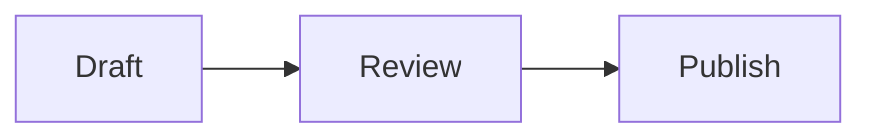

# Markdown Studio user manual

Markdown Studio is a browser-based Markdown editor that runs from files on your computer. It combines a Markdown source editor, a live preview, a visual editing mode, local drafts, and tools for working with a folder of notes. It needs no account, server, or installation after you extract the download.

## Privacy and where your data lives

Markdown Studio processes your documents in your browser. It has no document upload or synchronization feature, and its author and other users cannot access your notes through the app. The Markdown renderer and other libraries are included in the download, so normal editing works without an internet connection.

Drafts and settings are kept in **this browser's local storage**. If you open a folder with write permission, the app can also read and write the files in that folder, subject to the browser's permission prompt. You control which folder it can access. Anyone who can access your browser profile or your files on this computer may also be able to read them; use your device's normal access controls for sensitive work.

Opening an external link or downloading the app contacts that website. In the regular preview, remote images are replaced by a **Load external image** button until you choose to load one. **Visual** mode may load remote images referenced in a note. For strictly offline work, avoid remote image URLs and external links, and use the extracted app without a network connection.

## Download and start

1. Download the [standalone Markdown Studio ZIP](https://github.com/wolfgangheinz/Markdown/releases/latest/download/Markdown-Studio.zip).
2. Extract it. Keep `index.html` and the `app/` folder together, inside the extracted `Markdown-Studio/` folder.
3. Double-click `index.html` or drag it into a modern browser. No web server is needed.
4. Start typing in the Markdown pane. The preview updates as you write.

The first launch opens a `Welcome.md` draft. Later launches restore local drafts and the selected view when the browser's storage is available. Chrome and Edge offer the fullest folder editing support. Other browsers can still edit drafts and individual files; folder access may be read-only.

## Your workspace

The top bar contains the document name, save status, formatting tools, **File** menu, theme switch, and view buttons. Click the document name to rename the current draft; press **Enter** or click away to keep the new name. If a name conflicts with an existing draft, Markdown Studio adds a suffix.

The four views are:

| View | What it shows |
| --- | --- |
| **Split** | Markdown source and rendered preview side by side. Drag the divider to resize them. |
| **Visual** | An editable rendered document. Markdown is updated as you edit. |
| **Markdown** | Source editor only. |
| **Preview** | Rendered document only. |

The left **Explorer** shows the files in an opened folder. The tabs above the editor switch between open notes; closing a tab leaves its local draft in **File → Drafts**. The right sidebar has **Outline**, **Backlinks**, and **Graph** panels. Both sidebars can be collapsed. The sun/moon switch changes between light and dark themes. Your view, theme, and layout preferences are remembered locally.

### Write and format Markdown

Type Markdown in **Split** or **Markdown** view and watch the preview. The toolbar provides undo/redo, bold, italic, strikethrough, highlighting, inline code, headings, lists, tasks, quotes, links, images, tables, and code blocks. For example:

```markdown
# Project notes

A short introduction with **bold text** and *emphasis*.

## Tasks

- [ ] Review the draft
- [x] Collect references

> Keep the first version simple.

[Read more](https://example.com)
```

Markdown Studio renders headings, lists, tables, task lists, links, images, and fenced code blocks. It highlights Markdown syntax in the editor and code syntax in the preview. HTML pasted or opened as a file is converted to Markdown when possible. Rich text pasted into the editor is also converted when possible. A YAML frontmatter block at the beginning of a note remains in the source but is omitted from the preview.

Mermaid diagrams are supported locally. Write a fenced code block with `mermaid` after the opening fence; the preview turns it into a diagram. For example:

````markdown

````

Edit the Mermaid text in **Split** or **Markdown** view if you need to change the diagram.

In **Visual** view, edit the rendered content directly. Use the toolbar or the common formatting shortcuts. Switch back to **Split** or **Markdown** to inspect the resulting Markdown. Some complex Markdown may be easier to edit in the source pane.

## Drafts, files, and folders

### Local drafts

Choose **File → New** to create a new local draft. Existing work remains available under **File → Drafts**, where you can open, rename, or delete drafts and see an approximate browser storage indicator. Deleting a draft asks for confirmation and cannot be undone from within the app. **File → Clear Draft** deletes a local draft after confirmation.

Local drafts save automatically in your browser, about three seconds after editing stops. They are also saved when the page is hidden or closed. **Saved locally** means the browser stored the draft; it does **not** mean there is a separate file on disk. Browser storage has limits and can be cleared by browser settings, private browsing, or a profile reset. For a durable backup, download or save important documents as files.

### Open one file

Choose **File → Open** to import a Markdown (`.md`, `.markdown`), text (`.txt`), or HTML (`.html`, `.htm`) file. You can also drag a file into the workspace. HTML is converted to Markdown; check the result before saving. The opened content is retained as a local draft.

Outside an opened folder, **File → Save** (or **Ctrl/⌘+S**) downloads the current Markdown as a file. **File → Save As** opens a destination picker in browsers that support it; otherwise it downloads a copy. The browser may choose a Downloads location or ask where to save, according to its settings.

### Open a folder of notes

Choose **File → Open Folder** or **Open Folder** in the Explorer. If your browser supports writable folder access, approve the browser's permission prompt. The Explorer lists `.md` and `.markdown` files, including files in subfolders. Click a filename to open it; click a folder name to expand or select that folder. The **+** button creates a new Markdown file in the selected folder when write access is available.

Some browsers offer only a folder picker that supplies read-only copies. In that case, you can browse and edit notes as local drafts, but the app cannot write changes back to the original folder. Use **File → Save As** to export a copy. If the app shows **Reconnect** after reopening, select the folder again and grant access as needed. Folder permissions and remembered connections depend on the browser.

### Autosave and Save, at a glance

| Situation | Automatic save | **File → Save** |
| --- | --- | --- |
| Local draft or single imported file, outside an opened folder | Saves a local browser draft. | Downloads a Markdown file. |
| File in a writable folder, **Autosave to disk** on | Writes the folder file after editing pauses; also keeps a local copy. | Writes the same folder file immediately. |
| File in a writable folder, **Autosave to disk** off | Keeps edits locally and marks them as unsaved. | Writes the folder file. |
| File in a read-only folder | Cannot write to the original; a local draft is retained when the page is hidden or closed. A disk save error may appear. | Cannot write the original folder file; use **Save As** to export a copy. |

The **Local / Disk** toggle beside the document name appears when a folder is open. Switch **Autosave to disk** off if you want to review changes before writing them to the folder. The save status at the top reports local saving, disk saving, unsaved changes, or an error. When disk autosave is off, the browser may warn you before closing with unsaved folder changes; saving a local copy does not write the original file.

Use **Disconnect Folder** at the bottom of the Explorer to close that folder's files and return the sidebar to its empty state. The editor then shows **Create new file**, **Open draft**, and **Open Folder**; it does not select a different draft automatically. If any folder files have unsaved changes, choose **Save and disconnect**, **Discard changes**, or **Cancel**. If a file cannot be saved, the folder stays open so you can resolve it or choose to discard the changes. Other drafts remain available through **Open draft**.

Closing the last document tab also shows this empty workspace. The closed draft remains in local storage until you delete it from the draft manager.

**File → Clear Draft** behaves differently for folder files: it reverts the current note after confirmation. With disk autosave on, it restores the version from when the file was opened **and writes that version to disk**. With disk autosave off, it discards unsaved edits and restores the last saved version. Check the confirmation message before proceeding.

## Navigate a folder of notes

Folder navigation works with Markdown links such as `[Next](next.md)` and wiki-style links such as `[[Next]]`. Selecting a note in the Explorer or clicking an internal note link opens that note. The folder index also powers these tools:

- **Quick Switcher** finds notes by name or path.
- **Vault Search** searches indexed note contents.
- **Outline** lists headings in the current note; click one to jump to it.
- **Backlinks** lists other notes that link to the current folder file.
- **Graph** shows the group of notes connected to the current file by links. Choose **Explore graph** or **File → Graph** for a larger view. Search, pan, zoom, show or hide labels, fit the view, focus the current note, select a node, and open the selected note there.
- **Command Palette** offers New note, Open folder, sidebar toggles, and Save current note.

The graph and backlinks use the opened folder's Markdown notes. Notes unrelated to the current file do not appear in its graph view. These tools work locally and do not upload the folder.

## Export, copy, and print

- **File → Copy MD** copies the Markdown source.
- **File → Copy Rich** copies the rendered HTML for pasting into another application.
- **File → Export HTML** downloads a standalone HTML rendering of the current note.
- **File → Print** opens the browser's print dialog, where you can print or save a PDF.

Copied content is placed on your device's clipboard. Pasting it into another application is your choice.

## Keyboard shortcuts

Use **Ctrl** on Windows/Linux or **⌘** on macOS. Formatting shortcuts apply while the editor has focus; the available shortcuts in Visual mode depend on the selected content.

| Shortcut | Action |
| --- | --- |
| **Ctrl/⌘+B** | Bold |
| **Ctrl/⌘+I** | Italic |
| **Ctrl/⌘+1** | Heading |
| **Ctrl/⌘+K** | Insert a link |
| **Ctrl/⌘+backtick** | Insert a fenced code block |
| **Ctrl/⌘+S** | Save or download, depending on the open document |
| **Ctrl/⌘+Z** | Undo |
| **Ctrl/⌘+Shift+Z** or **Ctrl/⌘+Y** | Redo |
| **Ctrl/⌘+O** | Open a file when no folder is open; open Quick Switcher when a folder is open |
| **Ctrl/⌘+P** | Open Command Palette |
| **Ctrl/⌘+Shift+F** | Search the opened folder |
| **Tab / Shift+Tab** | Indent / outdent selected lines in the Markdown editor |

In Quick Switcher, Search, and Command Palette, use **↑/↓** to select, **Enter** to act, and **Esc** to close. Some browser shortcuts may take precedence when focus is outside the editor.

## Practical tips

- Keep the extracted `app/` folder beside `index.html`; the editor needs its bundled JavaScript and CSS to run offline.
- Use **Drafts** to recover a closed tab. Closing a tab does not delete its draft.
- If **Saved locally** changes to **Could not save locally**, free browser storage from **Drafts** and save important notes as files.
- If folder saving fails, check the browser's folder permission or reconnect the folder. Save As can preserve an editable copy.
- The app remembers drafts in the browser profile where you used it. Another browser or profile has separate storage; moving or clearing browser data can also affect access to those drafts.
